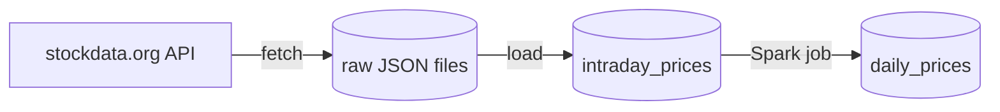
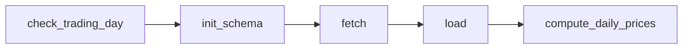
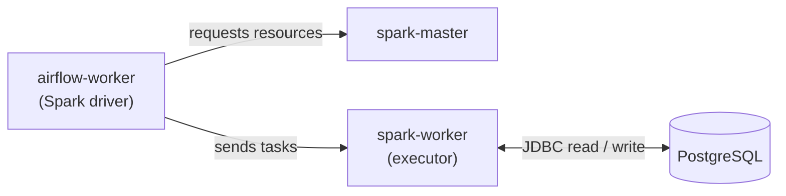

# market-tracker


Batch pipeline that ingests intraday stock prices from the [stockdata.org](https://www.stockdata.org/) API into PostgreSQL and builds daily candles with metrics using Apache Spark. Orchestrated with Apache Airflow 3, running in Docker Compose.

**Stack:** Python · Airflow 3 · Spark 4 (PySpark) · PostgreSQL · SQLAlchemy · Docker · pytest · Ruff · GitHub Actions

## Architecture

**Data flow**



**DAG**



**Spark job at runtime**



## How it works

The `market_tracker` DAG runs daily at 22:00 UTC and processes one trading day per run:

| Task | What it does |
|---|---|
| `check_trading_day` | Skips the run if the NYSE was closed on the target day |
| `init_schema` | Creates the database tables if they don't exist |
| `fetch` | Saves the raw API response to a partitioned JSON file (per ticker, in parallel) |
| `load` | Upserts the file's rows into `intraday_prices` |
| `compute_daily_prices` | Submits the Spark job to the cluster |

### Spark job

| Step | Function | What it does |
|---|---|---|
| Read | `read_prices` | Loads `intraday_prices` over JDBC |
| Aggregate | `aggregate_daily` | Builds one candle per ticker and day: first `open`, max `high`, min `low`, last `close`, summed `volume`. Extended-hours bars are excluded |
| Enrich | `add_daily_metrics` | Adds `prev_close`, `daily_return` and `ma_7` (7-row moving average) with window functions |
| Write | `write_daily_prices` | Truncates `daily_prices` and writes the full result |

Airflow submits the job with `SparkSubmitOperator` to a Spark standalone cluster running in Compose. The driver only plans the job and coordinates the executor. Data moves between the executor and the database and never passes through the Airflow container.

At this data volume plain SQL would be enough. Spark is used here to practise the tool on a realistic pipeline.

## Key features

- **Idempotent** - re-running a date doesn't duplicate rows; `daily_prices` is fully refreshed on every run
- **Backfills** - each run processes the day given by its `logical_date`
- **Layered data** - raw files, intraday rows and daily candles are kept separately
- **Failure isolation** - each ticker is fetched, loaded and retried independently
- **Tested** - unit tests (including Spark transformations) and linting run on every push

## Setup

Requires Docker with at least 4 GB of memory and a free API key from [stockdata.org](https://www.stockdata.org/).

1. Create `.env` from `.env.example` and fill in `STOCKDATA_API_TOKEN` and `FERNET_KEY`. Generate the key with:
   ```bash
   python -c "import base64, os; print(base64.urlsafe_b64encode(os.urandom(32)).decode())"
   ```
2. Set tickers and interval in `dags/pipeline_config.yaml`.
3. Start the stack:
   ```bash
   docker compose build
   docker compose up airflow-init
   docker compose up -d
   ```
4. Open the Airflow UI at <http://localhost:8080> (login `airflow` / `airflow`) and unpause the `market_tracker` DAG.

The Spark master UI is at <http://localhost:8081> and the market database at `localhost:5433`.

## Usage

```bash
# Run the DAG for a single date
docker compose exec airflow-scheduler airflow dags test market_tracker 2026-09-29

# Backfill a date range
docker compose exec airflow-scheduler airflow backfill create --dag-id market_tracker --from-date 2026-09-01 --to-date 2026-09-30
```

## Development

```bash
python -m venv venv
venv\Scripts\activate        # Windows
# source venv/bin/activate   # Linux/Mac
pip install -r requirements-dev.txt
pip install -e .
pre-commit install

pytest
ruff check .
```

Spark tests need Java 17 or 21. Tests use no database or network access.

## Project structure

```
dags/                       # DAG definition and pipeline config
src/market_tracker/
├── fetch.py                # API client, writes raw files
├── load.py                 # loads raw files into PostgreSQL
├── trading_calendar.py     # NYSE trading day check
├── db/                     # engine, models, schema
└── spark/
    ├── session.py          # SparkSession builder
    ├── postgres.py         # JDBC read and write
    ├── transformations.py  # daily aggregation and metrics
    └── jobs/daily_prices.py
tests/
```

## Known limitations and roadmap

- Missing trading days make `daily_return` and the moving average span a longer period
- The job assumes a single interval in `intraday_prices`
- `daily_prices` is fully recomputed instead of updated incrementally
- Planned: data quality checks, integration tests against PostgreSQL, dbt transformations