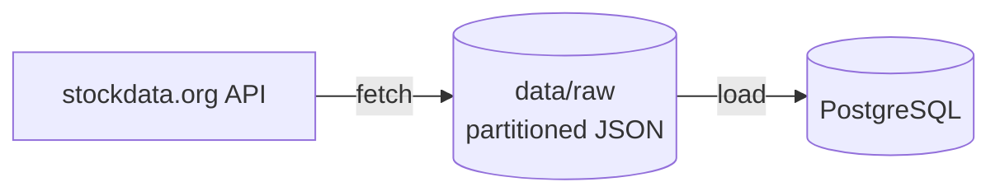
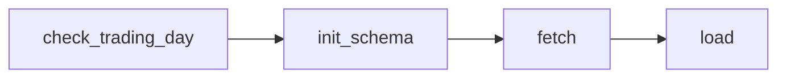

# market-tracker


> **Status:** Work in progress - actively being developed.

Batch pipeline that ingests intraday OHLCV stock data from the [stockdata.org](https://www.stockdata.org/) API into PostgreSQL, orchestrated with Apache Airflow 3 and running in Docker Compose.

## Architecture

**Data flow**



**DAG**



## Stack

Python · Apache Airflow 3 · PostgreSQL · SQLAlchemy · Docker · pytest · GitHub Actions

## How it works

The `market_tracker` DAG runs daily at 22:00 UTC and processes one trading day per run.

1. **check_trading_day** - computes the target day (`logical_date` minus the API data delay) and skips the run if the NYSE is closed that day.
2. **init_schema** - creates the database tables if they don't exist.
3. **process_ticker** - runs in parallel for each ticker in `dags/pipeline_config.yaml`:
   - **fetch** - saves the raw API response to `data/raw/intraday/interval=<interval>/ticker=<ticker>/date=<YYYY-MM-DD>.json`
   - **load** - upserts the file's rows into the `intraday_prices` table

A SQL view `ohlcv` aggregates intraday rows into daily bars.

## Key features

- **Idempotency** - re-running a date overwrites the same file and doesn't duplicate rows
- **Backfills** - each run processes the day given by its `logical_date`
- **Raw data layer** - API responses are kept on disk in a Hive-style partitioned layout
- **Failure isolation** - each ticker is processed and retried independently
- **Error handling** - API errors, timeouts and missing data fail the task and trigger retries
- **Tested** - unit tests and linting run on every push

## Setup

**Requirements:** Docker with at least 4 GB of memory, and a free API key from [stockdata.org](https://www.stockdata.org/).

1. Create `.env` from `.env.example`:
   ```env
   STOCKDATA_API_TOKEN=your_token_here
   AIRFLOW_UID=50000
   FERNET_KEY=
   ```
   Generate `FERNET_KEY` with:
   ```bash
   python -c "import base64, os; print(base64.urlsafe_b64encode(os.urandom(32)).decode())"
   ```

2. Set tickers and interval in `dags/pipeline_config.yaml`:
   ```yaml
   tickers:
     - AAPL
     - GOOGL
   interval: minute   # minute or hour
   ```

3. Start the stack:
   ```bash
   docker compose build
   docker compose up airflow-init
   docker compose up -d
   ```

4. Open the Airflow UI at <http://localhost:8080> (login `airflow` / `airflow`) and unpause the `market_tracker` DAG.

5. Create the daily aggregation view (one-off):
   ```bash
   docker compose exec -T db psql -U admin -d market-db < sql/create_views.sql
   ```

The market database is available at `localhost:5433`.

## Usage

Run the DAG for a single date:

```bash
docker compose exec airflow-scheduler airflow dags test market_tracker 2026-09-29
```

Backfill a date range:

```bash
docker compose exec airflow-scheduler airflow backfill create --dag-id market_tracker --from-date 2026-09-01 --to-date 2026-09-30
```

## Local development

```bash
python -m venv venv
venv\Scripts\activate        # Windows
# source venv/bin/activate   # Linux/Mac
pip install -r requirements-dev.txt
pip install -e .
```

## Testing

```bash
pytest
ruff check .
ruff format --check .
```

Unit tests cover the API client (with a mocked API), record mapping and the trading calendar. They need no database or network access. The same checks run on every push and pull request via GitHub Actions.

## Project structure

```
.
├── .github/workflows/
│   └── ci.yml                  # lint and tests on every push
├── dags/
│   ├── market_tracker.py       # DAG definition
│   └── pipeline_config.yaml    # tickers and interval
├── src/market_tracker/
│   ├── fetch.py                # API client, writes raw files
│   ├── load.py                 # loads raw files into PostgreSQL
│   ├── trading_calendar.py     # NYSE trading day check, target day
│   ├── config.py
│   └── db/
│       ├── engine.py
│       ├── models.py
│       └── schema.py
├── tests/
│   ├── test_fetch.py
│   ├── test_load.py
│   └── test_trading_calendar.py
├── sql/
│   └── create_views.sql        # daily OHLCV view
├── Dockerfile
├── docker-compose.yaml
├── pyproject.toml
├── requirements.txt            # runtime dependencies
└── requirements-dev.txt        # runtime + pytest, ruff
```

## Roadmap

- Update existing rows on conflict
- Timezone-aware timestamps
- Automatic creation of the `ohlcv` view
- Data quality checks
- Integration tests against PostgreSQL
- Transformations with dbt
- Historical data processing with Spark